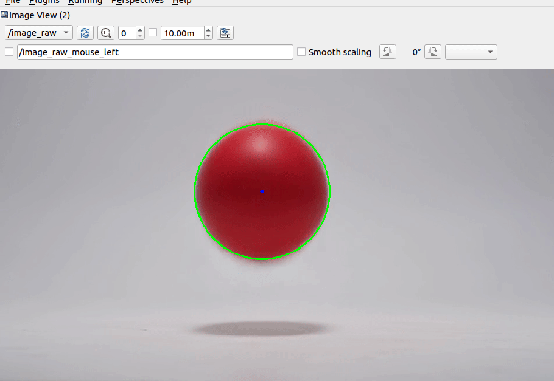

# ROS2 Red Ball Tracker with OpenCV

< A mini ROS2 project for real-time red ball detection and tracking using OpenCV >

This project demonstrates how to detect and track a red object (ball) in a video stream using OpenCV, and how to publish the image via ROS2.

---

## Features

- **color_pub_node.py** : Reads a video and detects the red ball using HSV filtering.
- Publishes the processed video with tracking overlay to the `/image_raw` ROS2 topic.
- Can be visualized using `rqt_image_view`.

---

## Environment

- Ubuntu 22.04
- ROS2 Humble
- Python 3.10
- OpenCV + cv_bridge
- VS Code (optional)

---

## How to Run

1. **Build the ROS2 workspace**
- cd ~/ros2_ws
colcon build
source install/setup.bash

2. **Run the tracking node**
ros2 run color_tracking color_pub

3. **Visualize the output**
rqt_image_view

## Result Preview

